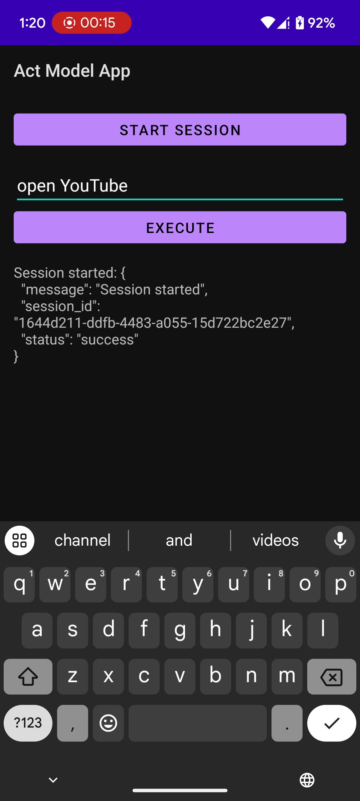

# LLM-Powered Mobile Assistant

Developed an LLM-powered mobile assistant using a fine-tuned LLaMA 3.1 8B model to achieve complex task execution with over 90% accuracy. Leveraged Appium for real-time app UI analysis and action automation, enabling dynamic interaction and error
recovery, allowing the assistant to adapt and navigate unfamiliar apps seamlessly.

## Overview

This project demonstrates an AI-powered mobile automation system that can:
- Understand natural language commands
- Analyze mobile app UI in real-time
- Execute complex multi-step tasks
- Adapt and recover from errors
- Navigate unfamiliar apps seamlessly

## Demo

A demonstration video showing the assistant in action is available in the repository `Action_Model_App_Demo.mp4`.



Action Model App Interface

## Key Components

### 1. Automation Server (`automation_server.py`)
The core server that:
- Manages Appium sessions for device control
- Processes UI analysis through LLaMA model
- Executes predicted actions on the device
- Handles error recovery and session management
- Provides REST API endpoints for interaction

Key features:
- Real-time screen analysis
- Dynamic action prediction
- Automated error recovery
- Session management
- Interaction logging

### 2. Startup Script (`start_automation.py`) 
Handles initialization of the automation environment:
- Checks and starts Appium server
- Verifies device connectivity
- Launches automation server
- Manages dependencies

### 3. Interaction Logger (`ai_interaction_log.txt`)
Maintains detailed logs of:
- Screen states
- AI predictions
- Executed actions
- Success/failure states
- Task progression

### 4. Dataset Generator (`gen_dataset.py`)
Tool for automatically generating training data:
- Captures real user interactions
- Records screen states
- Logs action sequences
- Creates structured datasets
- Example output in `youtube_interaction_dataset_auto.json`

## Technology Stack

- **AI Model**: LLaMA 3.1 70B (via Groq)
- **Automation**: Appium
- **Backend**: Python Flask
- **Device Control**: Android Debug Bridge (ADB)
- **API Integration**: Groq API


## Limitations & Future Work

Current limitations:
- Interaction speed is relatively slow
- Base model accuracy could be improved
- Limited to Android devices currently

Future improvements:
- Optimization for faster interaction
- iOS support
- Parallel session handling
- Enhanced error recovery

## Dataset Generation

The project includes tools for generating training datasets:
- Automated interaction capture
- Screen state recording
- Action sequence logging
- Structured data output

Example dataset structure in `youtube_interaction_dataset_auto.json`


## Note

The training data and fine-tuned model are not included in this repository due to privacy considerations. The included dataset generator (`gen_dataset.py`) demonstrates how to create similar training data for the YouTube app specifically.

## Prerequisites

- Android Studio installed on your computer
- Python 3.8+ installed on your computer
- Node.js and npm installed
- USB cable for device connection
- Android device with Developer options enabled
- Groq API key

## Initial Setup

### Step 1: Enable Developer Options on Android Device
1. Go to Settings
2. Scroll to "About phone"
3. Tap "Build number" 7 times until you see "You are now a developer"
4. Go back to Settings
5. Find "Developer options"
6. Enable "USB debugging"


### Step 2: Install Python Dependencies
```bash
pip install -r requirements.txt
```

### Step 3: Install Node.js Dependencies
```bash
npm install -g appium
npm install -g appium-doctor
npm install -g appium-uiautomator2-driver
```


### Step 4: Set Up Android Project
1. Open Android Studio
2. Click "Open Project" and select the project folder
3. Let Gradle sync complete
4. Update build.gradle file if needed

### Step 5: Connect Your Device
1. Connect Android device via USB
2. Accept USB debugging prompts on device
3. Verify connection:
```bash
adb devices
```

### Step 6: Configure Device Settings
Update device configuration in `automation_server.py`:
```python
options.set_capability('deviceName', 'Your Device Name')
options.set_capability('platformVersion', 'Your Android Version')
```

### Step 7: Set Environment Variables
```bash
export GROQ_API_KEY="your-api-key"
```

### Step 8: Start Automation
```bash
python start_automation.py
```